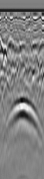
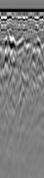

# 📡 GPR-gprMax Simulation Toolkit

A Python-based toolkit for **Ground-Penetrating Radar (GPR) simulation, B-scan processing, visualization, background subtraction, normalization, dataset validation, organization, and dataset preparation using gprMax**.

This repository provides reusable utilities and example workflows for researchers working with physics-based GPR simulations and machine/deep-learning applications.

---

## 🎯 Objectives

The objective of this project is to simplify and automate common operations involved in GPR simulation and data-processing workflows.

The toolkit is being developed to support:

- Generation and management of gprMax simulations
- Processing of gprMax `.out` files
- B-scan generation and visualization
- Batch B-scan processing
- Background-response subtraction
- GPR signal and image preprocessing
- B-scan intensity normalization
- Dataset integrity checking
- Dataset filtering and organization
- Preparation of simulated GPR data for machine/deep-learning applications

---

## 🔄 GPR Simulation Workflow

A typical workflow is:

```text
GPR Model Definition
        ↓
gprMax Input File (.in)
        ↓
FDTD Electromagnetic Simulation
        ↓
gprMax Output (.out)
        ↓
B-scan Generation
        ↓
Background Subtraction / Preprocessing
        ↓
B-scan Normalization
        ↓
Dataset Organization
        ↓
Dataset Integrity Checking
        ↓
Dataset Preparation
        ↓
Machine / Deep Learning
```

---

## 📂 Repository Structure

```text
GPR-gprMax-Simulation-Toolkit/
│
├── preprocessing/
│   └── background_subtraction.py
│
├── visualization/
│   ├── generate_bscan.py
│   └── batch_generate_bscans.py
│
├── dataset_tools/
│   ├── check_dataset.py
│   ├── normalize_bscans.py
│   └── organize_dataset.py
│
├── examples/
│   └── background_subtraction/
│       ├── target_background.png
│       ├── background_only.png
│       └── subtracted_gt.png
│
├── requirements.txt
├── .gitignore
└── README.md
```

Additional simulation, preprocessing, visualization, and dataset utilities will be added progressively.

---

## ⚙️ Installation

### 1. Clone the Repository

```bash
git clone https://github.com/Biswajit6448/GPR-gprMax-Simulation-Toolkit.git
```

### 2. Move Into the Project Directory

```bash
cd GPR-gprMax-Simulation-Toolkit
```

### 3. Install Python Dependencies

```bash
pip install -r requirements.txt
```

### 4. Install gprMax

gprMax should be installed separately according to the official gprMax installation instructions.

This toolkit is intended to complement a working gprMax environment rather than replace the gprMax installation itself.

> **Important:** Utilities that call `tools.plot_Bscan` should be executed from a Python environment in which gprMax and its tools are available.

---

# ▶️ Usage

## 1. Background Subtraction

The preprocessing utility performs background subtraction between two compatible gprMax simulations:

1. **Target + Background simulation**
2. **Background-only simulation**

The basic operation is:

```text
Target + Background
        −
Background Only
        ↓
Target-dominant Response
```

Run the utility using:

```bash
python preprocessing/background_subtraction.py target.out background.out subtracted.out
```

where:

- `target.out` — gprMax output containing the target + background response
- `background.out` — corresponding background-only gprMax output
- `subtracted.out` — output file containing the resulting subtracted response

### Example

```bash
python preprocessing/background_subtraction.py target.out background.out result.out
```

The utility checks compatible receiver structures and data dimensions before performing subtraction.

---

## 2. B-scan Generation

### Single B-scan Generation

A gprMax `.out` file can be visualized using the official gprMax B-scan plotting utility.

For example:

```bash
python -m tools.plot_Bscan result.out Ez
```

Here, `Ez` represents the electric-field component used for B-scan visualization.

The repository also contains:

```text
visualization/generate_bscan.py
```

for supporting standardized B-scan generation workflows.

### Batch B-scan Generation

For datasets containing multiple gprMax `.out` files, the toolkit provides:

```text
visualization/batch_generate_bscans.py
```

The utility recursively searches a specified directory and its subdirectories for `.out` files and invokes the official gprMax `tools.plot_Bscan` utility for each detected file.

Run:

```bash
python visualization/batch_generate_bscans.py "PATH_TO_DATASET_FOLDER" Ez
```

For example:

```bash
python visualization/batch_generate_bscans.py "H:\GPR_DATASET" Ez
```

The utility:

- Recursively searches directories for `.out` files
- Processes each detected gprMax output file
- Uses the official gprMax `tools.plot_Bscan` utility
- Supports selection of the electromagnetic field component
- Reports successful and failed processing attempts
- Provides a final batch-processing summary

Example terminal summary:

```text
Total files : 400
Successful  : 400
Failed      : 0
```

The default field component is `Ez`, so the component argument can be omitted:

```bash
python visualization/batch_generate_bscans.py "PATH_TO_DATASET_FOLDER"
```

> **Note:** gprMax and its `tools.plot_Bscan` module must be available in the active Python environment.

---

## 3. B-scan Normalization

The toolkit provides:

```text
dataset_tools/normalize_bscans.py
```

for preparing grayscale GPR B-scan images for machine/deep-learning workflows.

The utility:

- Recursively searches for supported image files
- Converts images to grayscale
- Performs per-image min-max intensity normalization
- Maps normalized values to the 8-bit range `0–255`
- Optionally resizes images
- Preserves the original directory structure
- Saves processed images to a separate output directory
- Does not overwrite the original dataset

### Normalization

For an image `I`, min-max normalization is conceptually performed as:

```text
I_norm = (I - I_min) / (I_max - I_min)
```

The normalized values are then mapped to:

```text
0 – 255
```

for storage as 8-bit grayscale images.

### Basic Usage

```bash
python dataset_tools/normalize_bscans.py "INPUT_DATASET" "OUTPUT_DATASET"
```

For example:

```bash
python dataset_tools/normalize_bscans.py "GPR_BSCANS" "GPR_BSCANS_NORMALIZED"
```

When no dimensions are specified, the original image dimensions are preserved.

### Normalize and Resize

To normalize images and standardize them to `64 × 256` pixels:

```bash
python dataset_tools/normalize_bscans.py "INPUT_DATASET" "OUTPUT_DATASET" --width 64 --height 256
```

Both `--width` and `--height` must be provided together.

### Non-destructive Processing

The input and output directories must be different.

```text
Original Dataset
       ↓
normalize_bscans.py
       ↓
Separate Normalized Dataset
```

The utility is designed to protect the source dataset from accidental overwriting.

### Important Research Consideration

The current utility performs **per-image min-max normalization**.

This improves intensity consistency within individual images and can be useful when preparing image-based inputs for machine/deep-learning models.

However, independent normalization of each B-scan changes the absolute amplitude relationship between different B-scans.

Therefore, researchers should select the normalization strategy according to the intended experiment.

For applications where absolute or relative signal amplitude across different measurements is physically important, alternative strategies such as dataset-level normalization or normalization based on fixed physical amplitude limits may be more appropriate.

---

## 4. Dataset Organization

The toolkit provides:

```text
dataset_tools/organize_dataset.py
```

for extracting and organizing selected GPR B-scan images from larger or mixed image directories.

The utility:

- Recursively searches an input directory for supported image files
- Can filter images according to required dimensions
- Can preserve the original directory structure
- Can create a flat output dataset
- Handles duplicate filenames safely
- Copies rather than moves source files
- Preserves source-file metadata where possible
- Reports copied, skipped, unreadable, and renamed files
- Does not modify or delete the source dataset

### Basic Usage

```bash
python dataset_tools/organize_dataset.py "INPUT_DATASET" "OUTPUT_DATASET"
```

Without additional options, supported images are copied while preserving their relative source directory structure.

### Filter by B-scan Dimensions

For datasets in which the required B-scans are standardized to `64 × 256` pixels:

```bash
python dataset_tools/organize_dataset.py "INPUT_DATASET" "OUTPUT_DATASET" --width 64 --height 256
```

Only images matching the specified dimensions are copied.

Both `--width` and `--height` must be specified together.

This can be useful when a simulation directory also contains larger plots, screenshots, geometry visualizations, or other images that should not be included in the ML/DL dataset.

### Flat Dataset Organization

To collect selected images directly into one output directory:

```bash
python dataset_tools/organize_dataset.py "INPUT_DATASET" "OUTPUT_DATASET" --width 64 --height 256 --flat
```

The workflow is:

```text
Mixed Simulation Directories
          ↓
Recursive Image Detection
          ↓
Dimension Filtering
          ↓
Select Required B-scans
          ↓
Flat Organized Dataset
```

### Preserve Directory Structure

When `--flat` is not specified, the relative source directory structure is preserved in the output dataset.

For example:

```text
Input/
├── Case_1/
│   └── scan_1.png
└── Case_2/
    └── scan_2.png
```

becomes:

```text
Output/
├── Case_1/
│   └── scan_1.png
└── Case_2/
    └── scan_2.png
```

### Duplicate Filename Handling

When flat-output mode is used, images originating from different directories may have identical filenames.

Instead of overwriting an existing image, the organizer generates a unique filename.

Conceptually:

```text
1.png
1_2.png
1_3.png
```

This protects previously copied files from accidental replacement.

> **Note:** Renaming duplicate filenames does not imply that the image contents are duplicates. Exact content duplication can be checked separately using `check_dataset.py`.

### Non-destructive Operation

The organizer copies selected images into a separate output directory.

```text
Source Dataset
      ↓
organize_dataset.py
      ↓
Organized Dataset
```

The source dataset is not modified or deleted.

The utility also prevents the output directory from being the same as, or placed inside, the source directory.

---

## 5. Dataset Integrity Checking

The toolkit includes a read-only dataset validation utility:

```text
dataset_tools/check_dataset.py
```

This utility recursively scans image datasets and checks for common problems that can affect GPR machine/deep-learning workflows.

It can identify:

- Total number of image files
- Valid and readable images
- Corrupted or unreadable images
- Image dimensions
- Images with unexpected dimensions
- Exact duplicate images using SHA-256 hashes
- Duplicate filenames across different directories
- Missing numbers in numerically named image sequences

The utility **does not modify, rename, resize, or delete any files**.

### Basic Usage

```bash
python dataset_tools/check_dataset.py "PATH_TO_DATASET"
```

By default, the expected B-scan dimensions are:

```text
Width  = 64 pixels
Height = 256 pixels
```

### Specify Different Expected Dimensions

```bash
python dataset_tools/check_dataset.py "PATH_TO_DATASET" --width 128 --height 256
```

### Skip Exact Duplicate Detection

For very large datasets, hash-based duplicate checking can be skipped:

```bash
python dataset_tools/check_dataset.py "PATH_TO_DATASET" --skip-duplicates
```

### Skip Numeric Filename Checking

```bash
python dataset_tools/check_dataset.py "PATH_TO_DATASET" --skip-missing
```

### Example Final Report

```text
================================================================================
FINAL REPORT
================================================================================
Total image files          : 4
Valid readable images      : 4
Corrupted/unreadable       : 0
Unexpected dimensions      : 0
Exact duplicate groups     : 0
Duplicate filename groups  : 0
Missing numeric filenames  : 0
================================================================================
```

The dimension check is particularly useful for identifying images that do not match the standardized dimensions expected by a machine/deep-learning pipeline.

The duplicate-filename check identifies files that share the same filename in different directories, while exact duplicate detection compares file content.

> **Note:** A duplicate filename does not necessarily mean that two images contain identical data. Exact duplicate detection is performed separately using file hashes.

### Recommended Validation Workflow

After organizing a dataset, the resulting directory can be checked immediately:

```bash
python dataset_tools/check_dataset.py "OUTPUT_DATASET" --width 64 --height 256
```

This provides an additional validation stage before the images are used for machine/deep-learning experiments.

---

## 🔗 Example Processing Pipeline

The available utilities can be combined into a GPR data-processing workflow:

```text
gprMax Simulation
        ↓
.out Files
        ↓
B-scan Generation
        ↓
Background Subtraction
        ↓
B-scan Images
        ↓
Normalization
        ↓
Dataset Organization
        ↓
Dataset Integrity Checking
        ↓
Validated Dataset
        ↓
Machine / Deep Learning
```

Each processing stage can also be used independently depending on the research workflow.

---

## 🖼️ Example: GPR Background Subtraction

The following example demonstrates background-response subtraction using simulated GPR B-scans.

<table>
<tr>
<td align="center"><b>Target + Background</b></td>
<td align="center"><b>Background Only</b></td>
<td align="center"><b>Subtracted / Ground Truth</b></td>
</tr>

<tr>
<td align="center">

</td>

<td align="center">

</td>

<td align="center">

</td>
</tr>
</table>

### Processing Concept

```text
Target + Background B-scan
             −
     Background-only B-scan
             ↓
   Target-dominant Response
```

The target-containing simulation includes both the background response and the response produced by the subsurface target.

A corresponding background-only simulation can therefore be subtracted to suppress the background contribution and obtain a target-dominant response.

---

## ⚠️ Important Requirement for Background Subtraction

For physically meaningful subtraction, the **target-containing simulation and background-only simulation should use matching environmental and acquisition configurations**, with the primary intended difference being the presence or absence of the target.

Relevant parameters include:

- Computational domain
- Spatial discretization
- Simulation time window
- Soil electromagnetic properties
- Surface geometry
- Antenna configuration
- Antenna trajectory
- Receiver configuration
- Background geometry
- Random realization/seed for stochastic geometries

This becomes particularly important for **rough, heterogeneous, or randomly generated surfaces and subsurface media**.

If different stochastic realizations are used for the target and background simulations, the subtraction may contain differences caused by the environment itself rather than only the target response.

---

## ⚡ About gprMax

**gprMax** is an open-source electromagnetic simulation software based on the **Finite-Difference Time-Domain (FDTD)** method.

It enables physics-based simulation of electromagnetic wave propagation and is widely used for Ground-Penetrating Radar modelling.

Typical GPR simulations can incorporate:

- Different soil electromagnetic properties
- Subsurface targets
- Different target geometries
- Different burial depths
- Antenna configurations
- Surface variations
- Heterogeneous environments

This repository provides supplementary Python utilities for processing and organizing data produced through such simulations.

---

## 🧠 Research Applications

The simulation and preprocessing workflows developed in this repository can support research in:

- GPR clutter suppression
- Subsurface target detection
- Target classification
- Target-response enhancement
- GPR signal processing
- GPR image processing
- Deep learning for GPR
- CNN-based GPR processing
- Transformer-based GPR processing
- Generative modelling
- Diffusion-based GPR processing

---

## 🛠️ Technologies

The project primarily uses:

- **Python**
- **gprMax**
- **FDTD electromagnetic simulation**
- **NumPy**
- **h5py**
- **Matplotlib**
- **OpenCV**
- **Pillow**
- **CUDA / GPU computing**

---

## 🚧 Project Status

**Under active development**

### Currently Available

- ✅ gprMax `.out` background subtraction
- ✅ Receiver/component compatibility checking
- ✅ Single B-scan visualization using gprMax
- ✅ Recursive batch detection of `.out` files
- ✅ Automated batch B-scan generation
- ✅ Success/failure reporting during batch processing
- ✅ Recursive B-scan image normalization
- ✅ Per-image min-max normalization
- ✅ Optional B-scan resizing
- ✅ Non-destructive normalized dataset generation
- ✅ Recursive dataset image organization
- ✅ Dimension-based B-scan filtering
- ✅ Flat-output dataset creation
- ✅ Directory-structure preservation
- ✅ Safe duplicate-filename handling
- ✅ Non-destructive dataset organization
- ✅ Dataset image integrity checking
- ✅ Image-dimension validation
- ✅ Corrupted/unreadable image detection
- ✅ Exact duplicate-image detection
- ✅ Duplicate-filename detection
- ✅ Numeric filename sequence checking
- ✅ Example background-subtraction B-scans
- ✅ Installation and usage documentation

### Planned Additions

- ⏳ Train/validation/test dataset splitting
- ⏳ Additional normalization strategies
- ⏳ Automated gprMax simulation workflows
- ⏳ Generic simulation examples
- ⏳ Additional preprocessing utilities

---

## 🔬 Research Motivation

Ground-Penetrating Radar measurements can contain strong responses from the ground surface, heterogeneous media, antenna coupling, and other environmental structures.

Physics-based simulation provides a controlled environment for studying these effects and generating data for signal-processing and machine-learning research.

The broader goal of this toolkit is to support workflows connecting:

```text
Electromagnetic Modelling
          ↓
    GPR Simulation
          ↓
   B-scan Processing
          ↓
Signal / Image Preprocessing
          ↓
Dataset Organization
          ↓
Dataset Validation
          ↓
Dataset Preparation
          ↓
Machine / Deep Learning
          ↓
Subsurface Target Analysis
```

---

## 👤 Author

**Biswajit Gope**

Research interests:

- Ground-Penetrating Radar (GPR)
- Electromagnetic Simulation
- Deep Learning
- Computer Vision
- GPR Clutter Suppression
- Subsurface Target Detection and Classification
- Signal and Image Processing
- UAV-based Systems

GitHub: **@Biswajit6448**

---

## ⚠️ Research & Data Notice

This repository contains selected **generic utilities, examples, and personally releasable research code** intended for research and educational purposes.

Institutional, confidential, proprietary, restricted, project-sensitive, or otherwise non-public datasets, configurations, documents, and source materials are **not included**.

Users of this repository are responsible for complying with the licenses, terms, and citation requirements of gprMax and any external software or datasets used in their work.

---

## 📚 Citation

If this repository contributes to published research, formal citation information will be provided here following publication.

---

## 🤝 Contributions

Suggestions, bug reports, and research-oriented improvements are welcome.

If you identify an issue with one of the utilities, please open a GitHub issue with sufficient information to reproduce the problem.

---

⭐ If you find this repository useful for GPR research, consider giving it a star.
